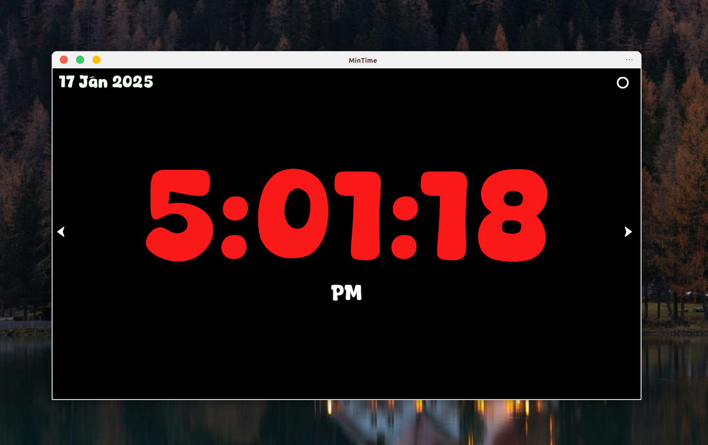
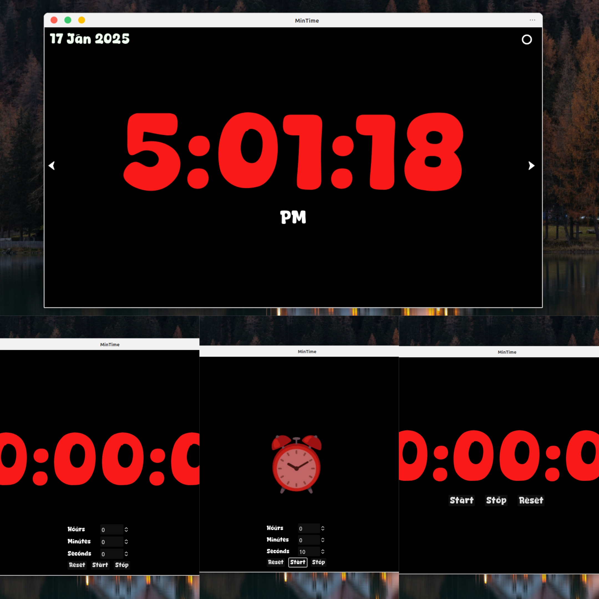

# MinTime

MinTime is a simple clock, timer and stopwatch application made with Godot.

I made this application for a personal use to keep track of time while doing some work.

## Features

- It automatically get's the time and date from the system and displays it.
- It has Stopwatch.
- It has Timer.

## Installation

To get this project to your local machine download the zip file or clone the repository and import the project into the godot.
Or you can also directly download it from the Godot asset library.

You are free to use, modify, and distribute this project as you wish.
