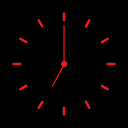

# MinTime

MinTime is a simple clock, timer and stopwatch application made with Godot.

I started this as a personal app to have time displayed like a big digital clock while working on something, later I decided to open source the project and maybe
it might be helpful to someone. 

## Features

- It automatically get's the time and date from the system and displays it.
- It has Stopwatch.
- It has Timer.

## Installation

To get this project to your local machine download the zip file or clone the repository and import the poject into the godot.

## Devlopment

You are free to download and modify the code however you like and also if you want to contribute to this project make a new branch, make changes
and submit pull request.

